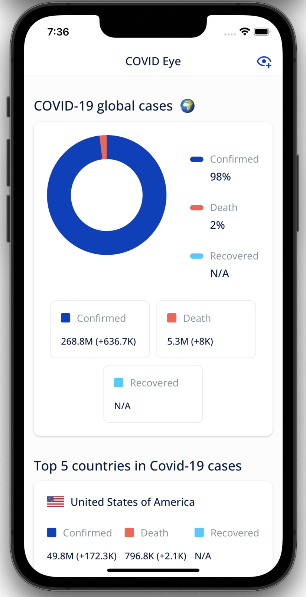
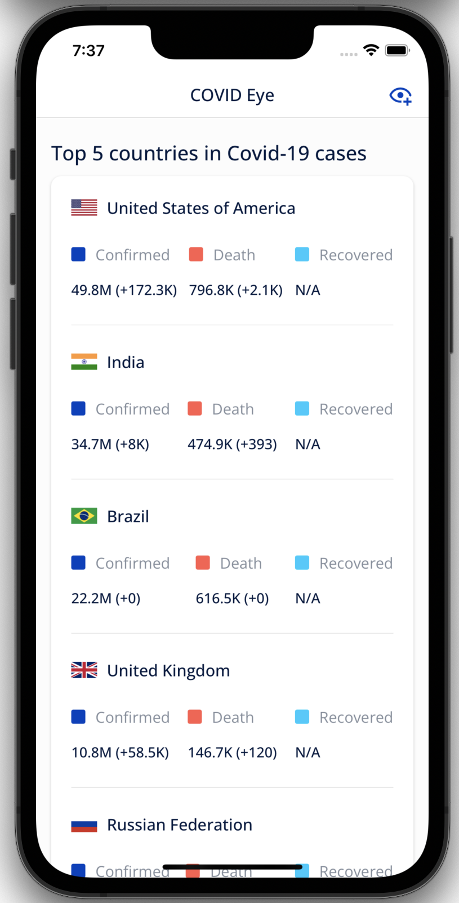
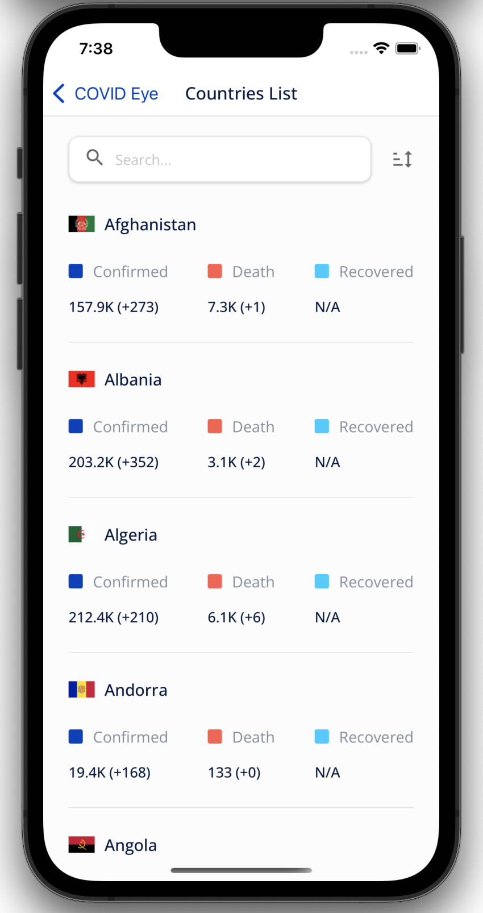
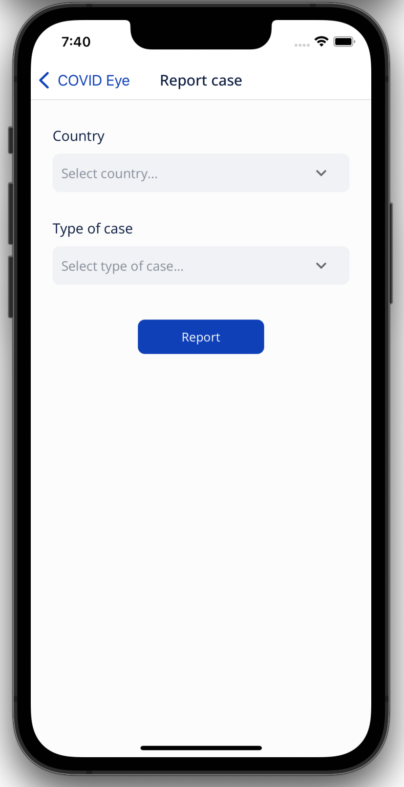

  # Covid Eye
Covid Eye is an app to view Covid-19 cases globally or per country, the data in the app is provided by [covid19api](https://covid19api.com/)
- Written in Typescript
- [react-query](https://react-query.tanstack.com/) for managing API communication
- [zustand](https://github.com/pmndrs/zustand) for state management
- [react-navigation](https://reactnavigation.org/) for navigation

### Features
- View global COVID19 cases
- View top 5 countries in Covid-19 cases
- List of all countries with Covid-19 cases analytics
- Report Covid19 case

### Screenshots
Global cases            |Top 5 countries in Covid19 cases            |Countries List            |Report case
:-------------------------:|:-----------------------------:|:-------------------------:|:-------------------------:
  |    |    |  

### How to run the app locally
- to run the app on iOS, run `npx pod-install` then run `npm run ios` in the terminal
- to run the app on Android, run `npm run android` in the terminal

### Note
Recovery data is not available on [covid19api](https://covid19api.com/) because it has been discontinued, for more information, please check this issue [#4465](https://github.com/CSSEGISandData/COVID-19/issues/4465)

### Credits
UI design is inspried by https://dribbble.com/shots/10700211-Medical-App-Exploration-COVID19-Tracker
